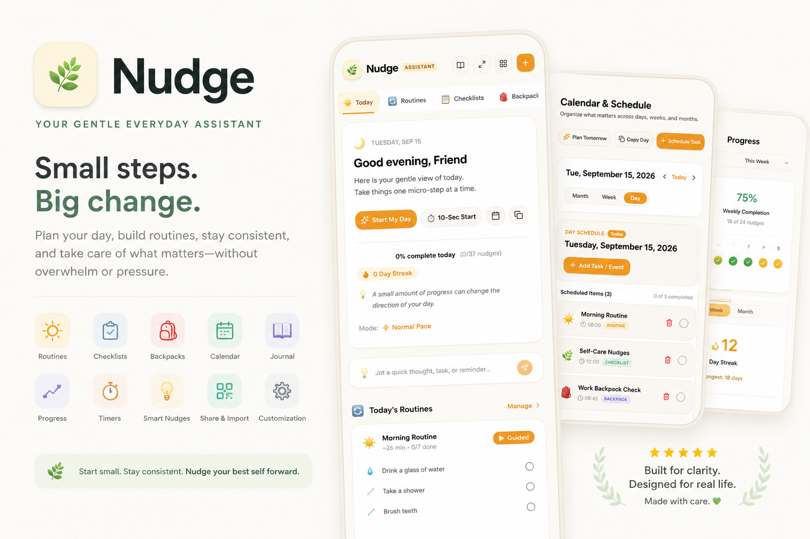

# Nudge

### Your gentle everyday assistant.

  

  <strong>Small steps. Real progress.</strong>

Nudge is an open-source everyday self-care and organization app designed to help you turn overwhelming days into small, manageable actions.

Instead of focusing on pressure, perfection, or complicated productivity systems, Nudge helps you take the next step—whether that means starting a routine, checking off a small task, planning your day, or simply getting yourself moving.

## Features

### 🏡 A Calm Home Screen

See what matters today from one simple dashboard.

- Daily completion progress
- Current date and personalized greeting
- Motivational tips
- Scheduled routines and tasks
- Quick actions
- Brain Dump for thoughts, tasks, and reminders
- Different modes to match your pace

### 🔄 Custom Routines

Create routines for the parts of your day you want to make easier.

Build routines for:

- Mornings
- Evenings
- Work
- School
- Studying
- The gym
- Self-care
- Getting ready to leave the house

Customize routines with names, emojis, colors, activities, durations, and ordering. Use full routines or shorter versions when you have less time or energy.

### 📋 Checklists

Create reusable checklists for everyday responsibilities.

Use them for:

- Self-care
- Cleaning
- Shopping
- Work
- School
- Daily tasks
- Personal goals

Check off items as you go and review your completed progress.

### 🎒 Backpacks

Keep reusable packing lists for the things you need to bring with you.

Create backpacks for:

- Work
- School
- The gym
- Travel
- Everyday essentials
- Leaving the house

Add custom items, quantities, emojis, and colors. Nudge can help you notice missing items before you leave.

### ⏱️ Start Small

Sometimes the hardest part of a task is beginning.

Nudge includes tools to help you take the first step, including:

- Start My Day
- Configurable countdowns
- Quick-start tools
- Guided routines
- Low-energy routine options
- Mental task-start prompts

Instead of thinking about everything you need to do, start with one basic action:

> Put toothpaste on your toothbrush.  
> Put food on your fork.  
> Open the document.  
> Put your shoes on.  
> Pick up the first item.

You do not have to finish everything immediately. Starting is progress.

### 🗓️ Calendar and Scheduling

Organize your days, weeks, and months with the Calendar.

- Month view
- Week view
- Day view
- Scheduled routines
- Tasks and reminders
- Journal entries
- Recurring schedules
- Date and time planning

Use the Calendar to plan ahead while keeping the Home screen focused on today.

### 📈 Progress and Streaks

Understand your progress without turning it into pressure.

Nudge tracks useful information such as:

- Daily completion
- Weekly progress
- Monthly progress
- Consistency
- Routine completion
- Streaks
- Completion history
- Checked-off items

Missing a day does not erase the work you have already done. Progress is information, not a judgment.

### 📖 Daily Journal

Use the Journal as a private space to record:

- Thoughts
- Moods
- Wins
- Challenges
- Daily reflections
- Personal observations

Entries can be connected to calendar dates and include mood emojis.

### 🎨 Personalization

Make Nudge feel like your own.

Customize:

- Routines
- Checklists
- Backpacks
- Activities
- Emojis
- Colors
- Themes
- Timer settings
- Reminders
- Appearance options

### 🔗 QR Sharing and Importing

Share supported routines, checklists, and backpacks through QR codes.

Scan a code, preview the content, and import it into your own Nudge setup.

## Privacy First

Nudge is designed around local-first privacy.

- Your information is stored in local files on your device.
- Your routines, tasks, checklists, backpacks, journal entries, and progress are not sent to a remote database.
- Nudge does not require an account or sign-in.
- Your information is not shared with a database or third-party tracking system.
- The app does not track your personal activity for advertising or analytics.
- Your data stays under your control on your device.

Because Nudge is open source, the code can be inspected, improved, and reviewed by the community.

> Your everyday information should belong to you.

## Open Source

Nudge is open source and built to be transparent, customizable, and community-friendly.

You can explore the code, suggest improvements, report issues, and contribute new ideas.

## Project Status

Nudge is actively being developed. Features and interfaces may continue to evolve as the project grows.

## Vision

Nudge is built around one simple idea:

> You do not have to do everything at once.

You can start small, take the next step, and build a better day one nudge at a time.

---

### Nudge

**Small steps. Real progress.**
